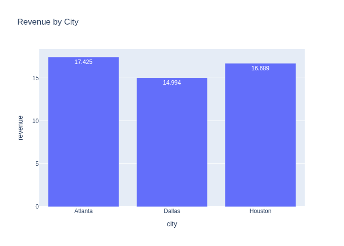
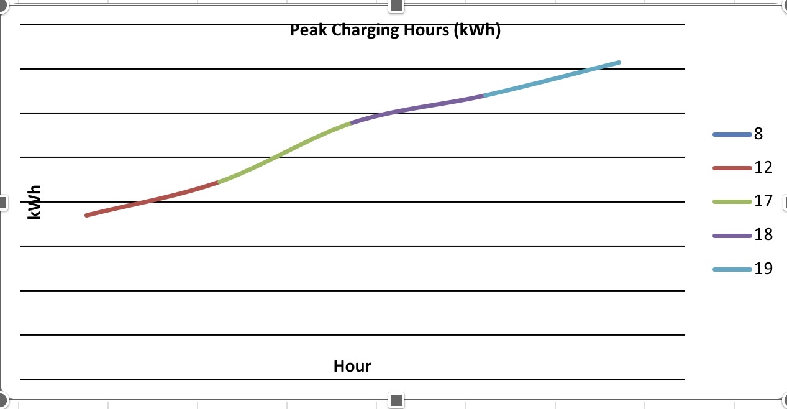

# EV Nest Charging Usage and Revenue Analysis

 

## 📌 Project Overview
Analyze electric vehicle (EV) charging sessions using SQL to uncover demand patterns, charger performance, and revenue drivers for a startup charging network.

## ✅ Key Features
- Realistic schema design for EV charging sessions
- Business-focused SQL queries for revenue and usage insights
- Visualizations for decision support
- Insights aligned with energy and tech domain

## 📊 Visualizations
### Revenue by City


### Peak Charging Hours


## 💡 Business Insights
- **DC Fast chargers generate higher revenue per session**
- **Evening hours show higher energy usage**
- **Urban stations outperform lower traffic locations**

## ▶ How to Run
1. Clone this repository:
   ```bash
   git clone https://github.com/<your-username>/ev-nest-sql-analysis.git
   ```
2. Navigate to the `sql/` folder and run `ev_nest_project.sql` in your SQL environment.

## 🛠 Skills Demonstrated
- SQL (DDL, DML, Aggregations)
- Data Analysis & Business Intelligence
- Visualization using Python & Plotly

## 📄 Resume Bullet
- Built SQL-based data analysis project analyzing EV charging demand, pricing, and revenue using simulated operational data for a startup charging network.

## 🚀 Future Enhancements
- **Add Python ETL pipeline** to automate data ingestion
- **Integrate Power BI dashboard** for interactive reporting
- **Expand dataset** to include seasonal and geographic trends
- **Predictive modeling** for demand forecasting

## 🔗 Connect
- [LinkedIn](https://www.linkedin.com/in/<your-profile>)
- [Portfolio](https://<your-portfolio-link>)

---
# EV Nest Charging Usage and Revenue Analysis

## Project Description
Data analysis project using SQL to analyze electric vehicle charging sessions for a startup charging network. The analysis focuses on demand patterns, charger performance, and revenue drivers to support pricing and expansion decisions.

## Database Setup
```sql
CREATE TABLE ev_charging_sessions (
    session_id INT,
    station_id INT,
    city VARCHAR(50),
    charger_type VARCHAR(20),
    session_start TIMESTAMP,
    session_end TIMESTAMP,
    kwh_used DECIMAL(6,2),
    price_per_kwh DECIMAL(4,2)
);

INSERT INTO ev_charging_sessions VALUES
(1, 101, 'Atlanta', 'Level 2', '2025-01-05 08:10', '2025-01-05 09:40', 18.5, 0.25),
(2, 101, 'Atlanta', 'DC Fast', '2025-01-05 18:20', '2025-01-05 18:55', 32.0, 0.40),
(3, 102, 'Houston', 'Level 2', '2025-01-06 12:00', '2025-01-06 14:10', 22.3, 0.23),
(4, 103, 'Dallas', 'DC Fast', '2025-01-06 19:15', '2025-01-06 19:50', 35.7, 0.42),
(5, 102, 'Houston', 'DC Fast', '2025-01-07 17:40', '2025-01-07 18:10', 28.9, 0.40);
```

## Core Analysis Queries
- Revenue by station
```sql
SELECT station_id, SUM(kwh_used * price_per_kwh) AS total_revenue
FROM ev_charging_sessions
GROUP BY station_id
ORDER BY total_revenue DESC;
```

- Average session duration by charger type
```sql
SELECT charger_type,
       AVG(EXTRACT(EPOCH FROM (session_end - session_start)) / 60) AS avg_minutes
FROM ev_charging_sessions
GROUP BY charger_type;
```

- Peak charging hours
```sql
SELECT EXTRACT(HOUR FROM session_start) AS hour_of_day,
       SUM(kwh_used) AS total_kwh
FROM ev_charging_sessions
GROUP BY hour_of_day
ORDER BY total_kwh DESC;
```

- Revenue by city
```sql
SELECT city,
       SUM(kwh_used * price_per_kwh) AS city_revenue
FROM ev_charging_sessions
GROUP BY city
ORDER BY city_revenue DESC;
```

## Visualizations
### Revenue by City


### Peak Charging Hours


## Insights
- DC fast chargers generate higher revenue per session.
- Evening hours show higher energy usage.
- Urban stations outperform lower traffic locations.

## Resume Bullet
- Built SQL-based data analysis project analyzing EV charging demand, pricing, and revenue using simulated operational data for a startup charging network.

